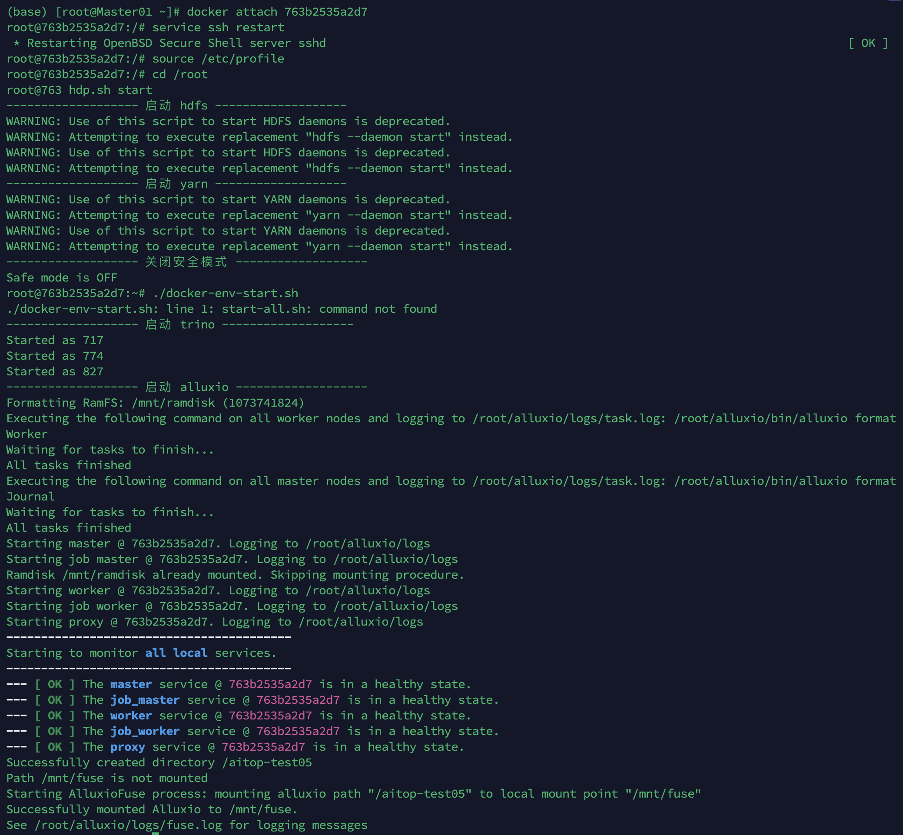

# Big Data Project

详细文档请见《基于数据编排系统Alluxio的场景应用与分析技术文档.pdf》，此文档全面介绍工作，详细讲解完整技术栈，强烈建议阅读。

PPT请见《基于数据编排系统Alluxio的场景应用与分析结项PPT.pptx》

分工请见《分工.docx》

**环境要求：需要不少于64GB内存，否则无法顺利启动整体环境！**

部署Docker
```
# 拉取镜像
docker pull zhezhidashi/bigdata-project-group5:1.0

# 启动容器
docker run --privileged -itd -u root zhezhidashi/bigdata-project-group5:1.0 /bin/bash

# 查看容器ID并进入容器
docker ps -a
docker attach {container_id}
```

启动环境需要运行的命令（一步也不能写错，否则实验将无法顺利进行！）

```
service ssh restart
source /etc/profile
cd /root

# 启动环境，可能会花费几分钟
hdp.sh start
./docker-env-start.sh
```


成功启动截图：



运行tpcds代码（请不要同时运行实验，一次只运行一个实验，否则可能内存溢出环境崩溃）
```
# 实验1
/root/trino/trino-test/test-tpcds-01/auto-test.sh
# 查看运行结果（可能需要几个小时的时间）
cat /root/trino/trino-test/test-tpcds-01/test-result.txt


# 实验1
/root/trino/trino-test/test-tpcds-02/auto-test.sh
# 查看运行结果（可能需要几个小时的时间）
cat /root/trino/trino-test/test-tpcds-02/test-result.txt
```

运行量化交易场景测试（请不要同时运行实验，一次只运行一个实验的其中一种线程的模式，如只运行线程1模式**或**只运行线程2模式，否则可能内存溢出环境崩溃）
```
# 实验1-线程1模式
/root/trino/trino-test/test01/thread-01/auto-test01-01.sh
# 查看运行结果（可能需要几个小时的时间）
cat /root/trino/trino-test/test01/thread-01/thread-01-result/*
# 实验1-线程2模式
/root/trino/trino-test/test01/thread-02/auto-test01-02.sh
# 查看运行结果（可能需要几个小时的时间）
cat /root/trino/trino-test/test01/thread-02/thread-02-result/*


# 实验2-线程1模式
/root/trino/trino-test/test02/thread-01/auto-test02-01.sh
# 查看运行结果（可能需要几个小时的时间）
cat /root/trino/trino-test/test02/thread-01/thread-01-result/*
# 实验2-线程2模式
/root/trino/trino-test/test02/thread-02/auto-test02-02.sh
# 查看运行结果（可能需要几个小时的时间）
cat /root/trino/trino-test/test02/thread-02/thread-02-result/*


# 实验3-线程1模式
/root/trino/trino-test/test03/thread-01/auto-test03-01.sh
# 查看运行结果（可能需要几个小时的时间）
cat /root/trino/trino-test/test03/thread-01/thread-01-result/*
# 实验3-线程2模式
/root/trino/trino-test/test03/thread-02/auto-test03-02.sh
# 查看运行结果（可能需要几个小时的时间）
cat /root/trino/trino-test/test03/thread-02/thread-02-result/*


# 实验4-线程1模式
/root/trino/trino-test/test04/thread-01/auto-test04-01.sh
# 查看运行结果（可能需要几个小时的时间）
cat /root/trino/trino-test/test04/thread-01/thread-01-result/*
# 实验4-线程2模式
/root/trino/trino-test/test04/thread-02/auto-test04-02.sh
# 查看运行结果（可能需要几个小时的时间）
cat /root/trino/trino-test/test04/thread-02/thread-02-result/*


# 实验5-线程1模式
/root/trino/trino-test/test05/thread-01/auto-test05-01.sh
# 查看运行结果（可能需要几个小时的时间）
cat /root/trino/trino-test/test05/thread-01/thread-01-result/*
# 实验5-线程2模式
/root/trino/trino-test/test05/thread-02/auto-test05-02.sh
# 查看运行结果（可能需要几个小时的时间）
cat /root/trino/trino-test/test05/thread-02/thread-02-result/*


# 实验6-线程1模式
/root/trino/trino-test/test06/thread-01/auto-test06-01.sh
# 查看运行结果（可能需要几个小时的时间）
cat /root/trino/trino-test/test06/thread-01/thread-01-result/*
# 实验6-线程2模式
/root/trino/trino-test/test06/thread-02/auto-test06-02.sh
# 查看运行结果（可能需要几个小时的时间）
cat /root/trino/trino-test/test06/thread-02/thread-02-result/*


# 实验7-线程1模式
/root/trino/trino-test/test07/thread-01/auto-test07-01.sh
# 查看运行结果（可能需要几个小时的时间）
cat /root/trino/trino-test/test07/thread-01/thread-01-result/*
# 实验7-线程2模式
/root/trino/trino-test/test07/thread-02/auto-test07-02.sh
# 查看运行结果（可能需要几个小时的时间）
cat /root/trino/trino-test/test07/thread-02/thread-02-result/*


# 实验8-线程1模式
/root/trino/trino-test/test08/thread-01/auto-test08-01.sh
# 查看运行结果（可能需要几个小时的时间）
cat /root/trino/trino-test/test08/thread-01/thread-01-result/*
# 实验8-线程2模式
/root/trino/trino-test/test08/thread-02/auto-test08-02.sh
# 查看运行结果（可能需要几个小时的时间）
cat /root/trino/trino-test/test08/thread-02/thread-02-result/*


# 实验9-线程1模式
/root/trino/trino-test/test09/thread-01/auto-test09-01.sh
# 查看运行结果（可能需要几个小时的时间）
cat /root/trino/trino-test/test09/thread-01/thread-01-result/*
# 实验9-线程2模式
/root/trino/trino-test/test09/thread-02/auto-test09-02.sh
# 查看运行结果（可能需要几个小时的时间）
cat /root/trino/trino-test/test09/thread-02/thread-02-result/*


# 实验10-线程1模式
/root/trino/trino-test/test10/thread-01/auto-test10-01.sh
# 查看运行结果（可能需要几个小时的时间）
cat /root/trino/trino-test/test10/thread-01/thread-01-result/*
# 实验10-线程2模式
/root/trino/trino-test/test10/thread-02/auto-test10-02.sh
# 查看运行结果（可能需要几个小时的时间）
cat /root/trino/trino-test/test10/thread-02/thread-02-result/*


# 实验11-线程1模式
/root/trino/trino-test/test11/thread-01/auto-test11-01.sh
# 查看运行结果（可能需要几个小时的时间）
cat /root/trino/trino-test/test11/thread-01/thread-01-result/*
# 实验11-线程2模式
/root/trino/trino-test/test11/thread-02/auto-test11-02.sh
# 查看运行结果（可能需要几个小时的时间）
cat /root/trino/trino-test/test11/thread-02/thread-02-result/*


# 实验12-线程1模式
/root/trino/trino-test/test12/thread-01/auto-test12-01.sh
# 查看运行结果（可能需要几个小时的时间）
cat /root/trino/trino-test/test12/thread-01/thread-01-result/*
# 实验12-线程2模式
/root/trino/trino-test/test12/thread-02/auto-test12-02.sh
# 查看运行结果（可能需要几个小时的时间）
cat /root/trino/trino-test/test12/thread-02/thread-02-result/*
```


关闭环境
```
cd /root
./docker-env-stop.sh
```
